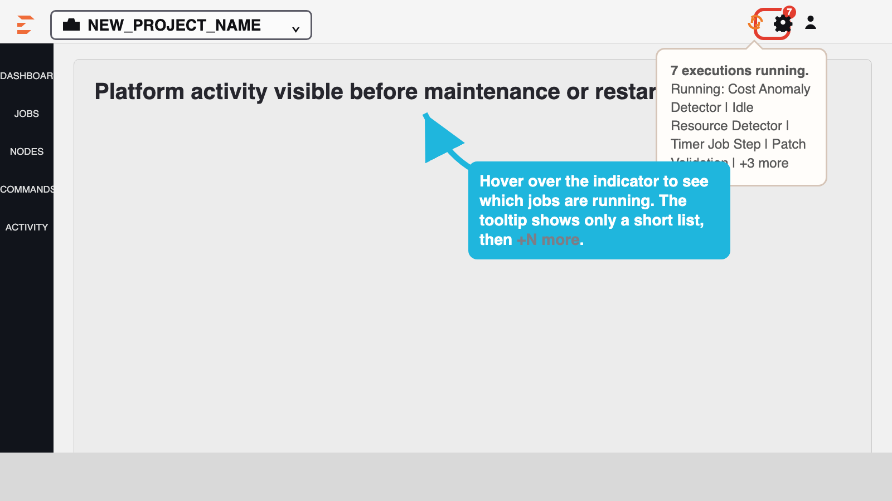

<h1 align="center">Rundeck Active Jobs Navbar Indicator Plugin</h1>

<p align="center">
  <strong>Shows when jobs are running, with a live count, directly in the top navbar</strong>
</p>

<p align="center">
  <a href="#installation">Installation</a> •
  <a href="#behavior">Behavior</a> •
  <a href="#usage">Usage</a> •
  <a href="#build-from-source">Build</a> •
  <a href="#support">Support</a>
</p>

<p align="center">
  
  
  
</p>

---

## Overview

This plugin adds a **global active-jobs indicator** next to the top-right system controls.

When executions are running, the icon animates and displays a badge count.
When no executions are running, the icon returns to idle.

## Why It Helps

This indicator is useful as a quick **platform safety signal**.

If operators are preparing to restart Rundeck or Runbook Automation for patching, upgrades, or maintenance, the indicator makes it obvious when the platform is still being used to run jobs.

That reduces the risk of interrupting active automation during maintenance windows.

## Example

The screenshot below shows the indicator in the top navbar, the running count badge, and the hover summary.



## Behavior

- Scope: all readable projects
- Trigger: execution start/finish events + route/activity updates
- Display: animated icon with running execution count
- Tooltip: current running summary with up to 4 job names, then `+N more`
- Debug text: not rendered in UI

## Compatibility

| Platform | Version |
|----------|---------|
| Rundeck Community | 5.x |
| Runbook Automation (Self-Hosted) | 5.x |

## Installation

Download the latest JAR from [Releases](https://github.com/rundecktoolkit/plugin-active-jobs-indicator/releases) and install via the Rundeck UI:

1. Navigate to **System Menu** -> **Plugins** -> **Upload Plugin**
2. Select the downloaded JAR file
3. Restart Rundeck if your deployment does not hot-load UI plugins

## Usage

- Run any job from any readable project.
- The top navbar indicator animates while jobs are running.
- The badge reflects concurrent running execution count.
- Hover over the indicator to see a short running-job summary without flooding the UI.

## Build from Source

### Requirements

- Java 11+

### Commands

```bash
./gradlew clean jar
```

Output: `build/libs/ui-active-jobs-navbar-indicator-1.0.1.jar`

## Support

- **Issues:** [GitHub Issues](https://github.com/rundecktoolkit/plugin-active-jobs-indicator/issues)
- **Reference plugin style:** [plugin-workflow-timer](https://github.com/rundecktoolkit/plugin-workflow-timer)

## License

MIT License - see [LICENSE](./LICENSE) for details.

---

<p align="center">
  <sub>Part of <a href="https://github.com/rundecktoolkit">rundecktoolkit</a> — Community plugins for Rundeck</sub>
</p>
